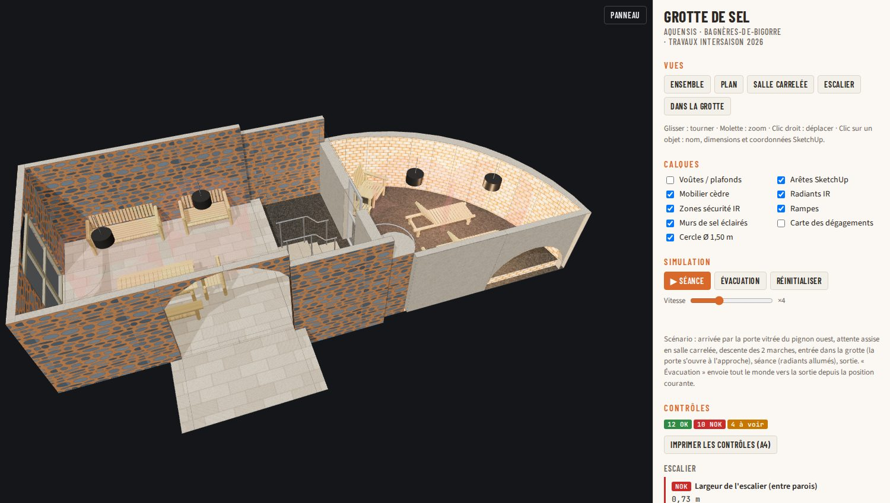
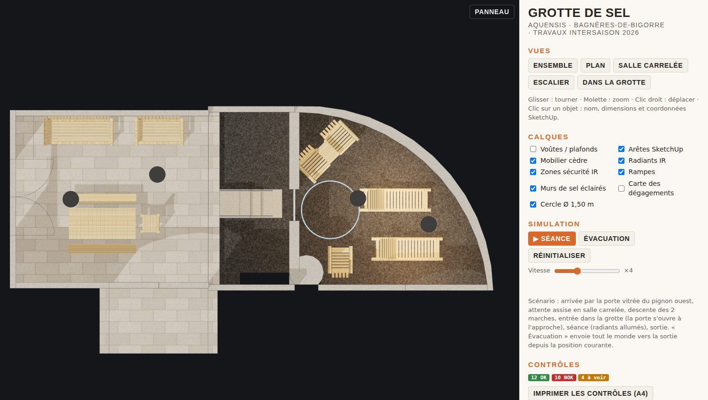
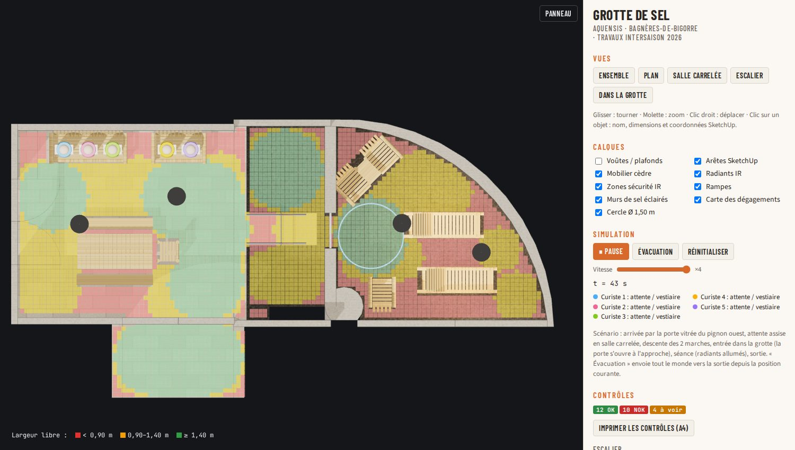
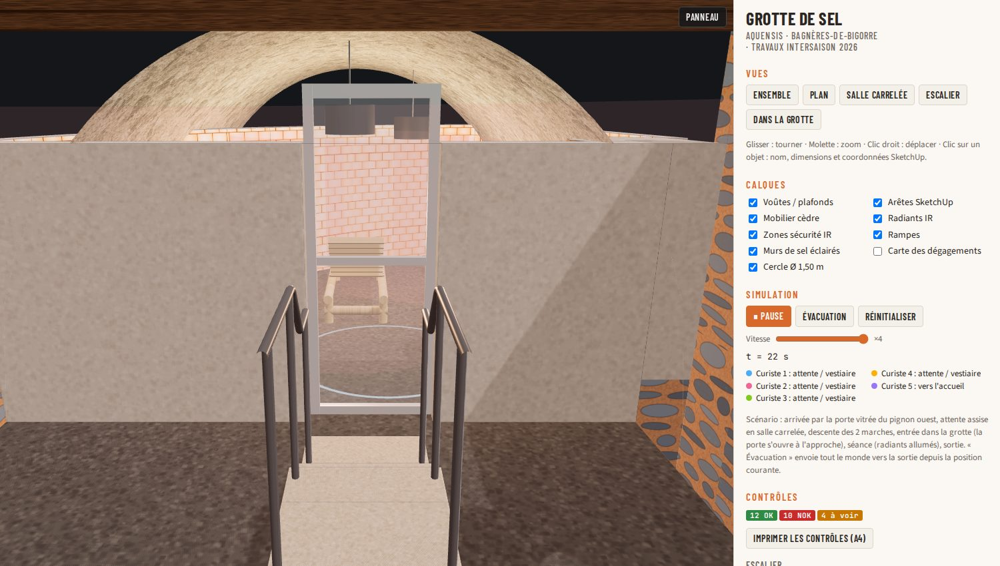
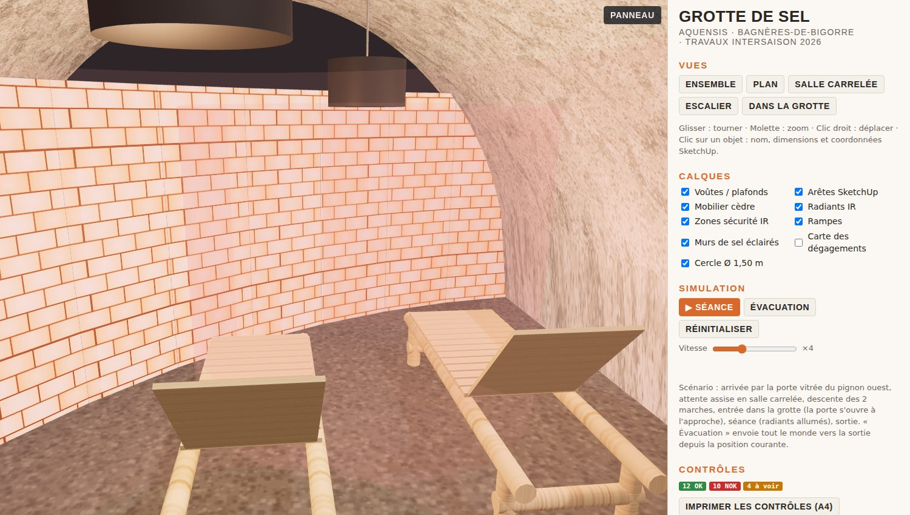

# Grotte de sel — Aquensis (travaux intersaison 2026)

Maquette 3D interactive de la future grotte de sel, construite à partir du SketchUp `model/grotte_de_sel1.skp`,
avec le mobilier Cèdre & Rondins, les radiants infrarouges Trotec, les mains courantes, les deux murs de sel
rétro-éclairés, un contrôle automatique des dégagements et une simulation de circulation des curistes.



## Ouvrir la maquette (Windows)

1. Sur GitHub : bouton vert **Code → Download ZIP**, puis clic droit sur le ZIP → **Extraire tout**.
2. Double-cliquer sur `index.html` (Edge ou Chrome). Tout fonctionne hors ligne (Three.js est inclus dans `js/vendor`).

Commandes : glisser = tourner, molette = zoom, clic droit = déplacer, clic sur un objet = nom, dimensions et
coordonnées X/Y/Z dans le repère SketchUp.

| Vue | Contenu |
|---|---|
|  | **Plan** : implantation vue de dessus |
|  | **Carte des dégagements** : rouge < 0,90 m, orange 0,90–1,40 m, vert ≥ 1,40 m |
|  | **Escalier** : 2 marches, avancée de 0,73 m, mains courantes, porte de la grotte |
|  | **Dans la grotte** : murs de sel rétro-éclairés, voûte encroûtée de sel, radiants |

## Ce que fait la maquette

- **Géométrie** : lue directement dans le `.skp` (447 sommets, 734 arêtes, 280 faces) par `tools/skp_extract.py`.
- **Textures** : moellons gris-bleu à joints orangés et voûte brique (salle carrelée), dallage pierre, chape sombre,
  croûte de sel blanche (voûte de la salle 2, d'après les photos), briques de sel de l'Himalaya rétro-éclairées.
- **Équipements** (`js/layout.js`) : chaises longues B17, tête-à-tête B7 TT, fauteuil B4A, canapés B6/B7,
  table B21B, bancs B20B, chaise B3 aux cotes catalogue ; 4 radiants Trotec IR 1500 SC (Ø 42 × 24 cm, chaîne 50 cm)
  avec leur volume de sécurité (vert = conforme, rouge = non conforme) ; 2 mains courantes inox à 0,90 m.
- **Simulation** : bouton **Séance** — arrivée par la porte vitrée du pignon ouest, attente assise, descente des
  marches, ouverture de la porte de la grotte à l'approche, séance (radiants allumés), sortie.
  Bouton **Évacuation** — tout le monde rejoint la sortie, avec le temps mesuré.
- **Contrôles** : liste OK / NOK / à voir dans le panneau, imprimable en A4 (bouton « Imprimer les contrôles »).
  Résumé dans [docs/CONTROLES.md](docs/CONTROLES.md).

## Modifier l'aménagement

Tout se règle dans **`js/layout.js`** (Bloc-notes suffit) : position `x`, `y` en mm dans le repère SketchUp,
orientation `rot` en degrés, liste des murs de sel éclairés, hauteur de chaîne des radiants, hypothèses de voûte.
Recharger la page (F5) : les contrôles se recalculent.

Si le SketchUp change, régénérer la géométrie (Python 3 installé) :

```
py tools\skp_extract.py model\grotte_de_sel1.skp js\model-data.js
```

## Hypothèses à confirmer sur place

- **Voûte de la grotte** : non dessinée dans le SketchUp. Prise d'après les photos de la salle 2 : berceau qui naît
  au sol, clé à 2,50 m (`voutes.grotte`). À remplacer par le relevé réel.
- **Plafond de la zone basse** : plat, bois, à 2,50 m (hauteur des murs du modèle).
- **Murs de sel** : le mur courbe et le mur sud (celui de l'arc du tunnel), les deux de 15 cm × 2,00 m dans le modèle.
- **Accès** : dans le SketchUp le mur côté alcôve sud est plein ; l'accès retenu est la double porte du pignon ouest.
- Les corrections papier sur les plans n'ont pas été transmises : elles ne sont pas intégrées.

## Arborescence

```
index.html              visionneuse (ouvrir ce fichier)
js/layout.js            aménagement modifiable
js/app.js               scène, contrôles, simulation
js/furniture.js         mobilier paramétrique + radiant
js/textures.js          textures procédurales
js/model-data.js        géométrie extraite du .skp (générée)
tools/skp_extract.py    extracteur SketchUp -> JS
model/                  fichier SketchUp source
docs/photos/            photos du chantier
docs/references/        notice Trotec IR 1500 SC (FR)
docs/CONTROLES.md       synthèse des contrôles
```
